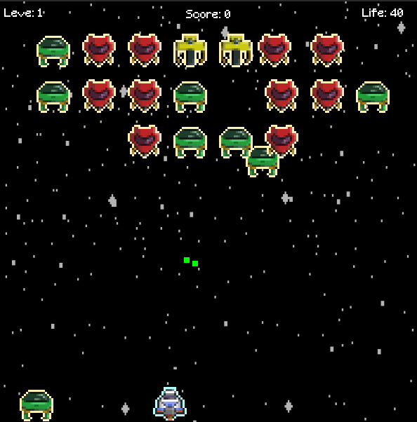

# space-invaders-like

This is a pygame project from scratch, doing this as a personal challenge to use my current skills. I also avoided existing "Space Invaders" tutorials, Instead, I focused solely on learning Pygame from the documentation or forums and exploring its functionality independently.

### requirements

- python 3.10
- python virtualenv
  ~~~shell
  pip install virtualenv
  ~~~

## how to run the project

- create the python environment with virtualenv

~~~shell
python -m venv venv
~~~

- run the environment

~~~shell
# linux
source venv/bin/activate
~~~

~~~bash
# windows
Script\activate.bat
~~~

- then install python requirements

~~~shell
pip install -r requirements.txt
~~~

- finally run the main python file

~~~shell
python main.py
~~~

## how to run unit tests

you need to run the virtual env first

~~~shell
python run_test.py
~~~
